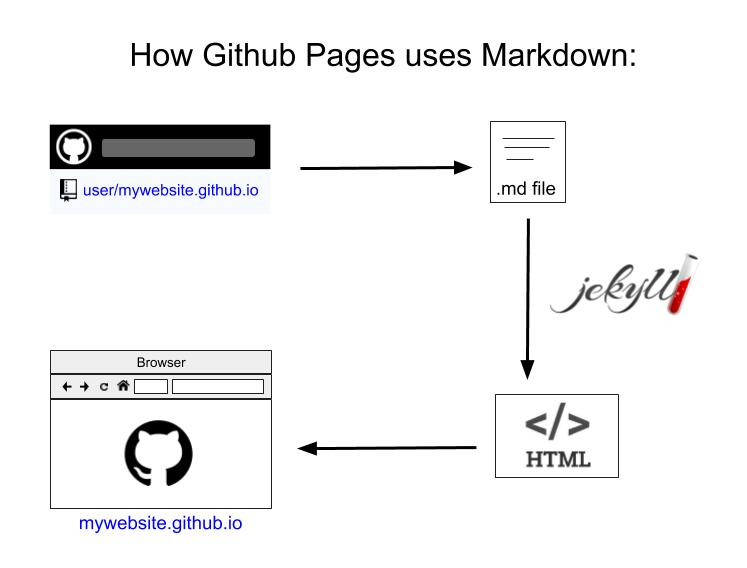

# How to Build a Website

## Part 2: Making Markdowns

So you’ve built a website on Github pages! Congratulations. Now we’re going to go more in depth with techniques for making and customizing the markdown files themselves. This guide will go through these basic rules for formatting your files, known as syntax. Besides this guide, I’d recommend you check out [Basic Syntax](https://www.markdownguide.org/basic-syntax/), and if this [Cheat Sheet](https://www.markdownguide.org/cheat-sheet/). These will be more cut and dry, but a good review, and have more examples than this guide.

[Markdown](https://www.markdownguide.org/) is an easy-to-use (really, we mean it) language used to make your webpages. The term “language” can seem intimidating, but the goal of Markdown is to be as readable as possible, so it doesn’t look confusing with formatting instructions (like HTML). Below is a side by side comparison of Markdown vs HTML. Now, the HTML doesn't look too difficult, but a full page of html becomes difficult to read through, while markdown it legible in the raw form.


**Markdown:**
``` 
 *Shelley v. Kraemer*
 ```
 ``` 
 **Shelley v. Kraemer**
 ```
 **HTML:**
 ```
 <p><i>Shelley v. Kraemer</i></p>
 <p><b>Shelley v. Kraemer</b></p>
 ```
**Browser:**

*Shelley v. Kraemer*

**Shelley v. Kraemer**


In fact, markdown gets turned into an HTML file to be viewed on Github pages, but you don’t have to view it in HTML. So, it’s like you have a translator taking the intuitive Markdown files and translating them into HTML so your website can be written. If you want a neat site that allows you to write in a Markdown editor that converts in real time, check out [Dillinger](https://dillinger.io/).

[Jekyll](https://jekyllrb.com/) is a tool used to publish those pages, making a neat looking website. Lucky for us, Jekyll can be as easy as choosing a built in theme, which we did in Part 1 of this tutorial. However, if you are looking for how to customize the theme or layout of the website itself, we also have an article on that.

Here’s a summary of how markdown, Jekyll, and Github work together to give you a nice looking final product:



If you are ready to improve your Markdown files, that’s what we hope to help you with! You may have just set up a site with a title, subtitle, and text. This means you already have learned Markdown! That’s a good start, but you’re going to want to know how to up your game a bit for an effective website to advertise your cause.

## 1. Headings and Subheadings:

First, we’ll go over how to make headings and subheading. We touched on this in part 1, but now we’re going to make it a bit more comprehensive.

To create a heading, add hashtag (#) signs with a space before your heading. The number of  hashtag (#) signs correspond to the heading level- the more hashtags (#) you add, the smaller the heading will be. For instance, let’s say you want to create a heading level 2, you would type ## before your heading text.

There are alternate ways you can create heading levels 1 and 2. on the line below the text, add any number of equal sign (==) characters for heading level 1 or dash (--) characters for heading level 2.

“Why are there two ways to get the same output?” you may ask. It’s really a matter of preference. Some people enjoy having the equal sign (==) or dash (--) characters because it stands out more, while others enjoy the hashtags because counting the number will automatically tell you what level heading it is. Choose whichever feels more natural to you (you can even alternate between them if you’d like); it will all look the same on the website!


 **Markdown**
 
 *Heading level 1:*
 ``` 
 # Segregation Beyond the Law 
 ```
 ```
 Segregation Beyond the Law
 ====
 ```
 *Heading level 2:*
```
 ## How legal systems failed to reverse residential segregation
 ```
 ```
 How legal systems failed to reverse residential segregation
 ---
 ```
 *Heading level 3:*
 ```
 ### In Minneapolis, MN
 ```
 **Browser:**
 
 # Segregation Beyond the Law
 ## How legal systems failed to reverse residential segregation
 ### In Minneapolis, MN


**Common mistake:** Note that you must add a space before your heading title. If you don’t add a space it will just show up as #heading.


## 2. Paragraph Text:

After you write some headings, you’ll want some text to go under them! Luckily, writing text is pretty simple. To create paragraphs, all you need to do is use a blank line to separate the lines of text.


 **Markdown:**
 ```
 In 1948, the United States Supreme Court case Shelley v. Kraemer made racially restrictive covenants in housing deeds unenforceable by state courts.
 
 Despite Shelley v. Kraemer, residential segregation remained present, enforced, and detrimental for African Americans in Minneapolis.
 ```
 **Browser:**
 In 1948, the United States Supreme Court case Shelley v. Kraemer made racially restrictive covenants in housing deeds unenforceable by state courts.

 Despite Shelley v. Kraemer, residential segregation remained present, enforced, and detrimental for African Americans in Minneapolis.


## 3. Emphasis:


### Bold or Italicize

If you want to *italicize*, add one asterisk (*) or one underscore (_) before and after the text you would like to Italicize. You can also bold part of a word by using an asterisk without spaces.

If you want to **bold**, add two asterisks (**) or underscores (__) before and after the text you would like to bold. You can also bold part of a word by using two asterisks without spaces. 

But what if you want the best of both worlds? Bold and Italic. Well, luckily for you, you just need 3 asterisks (***) or underscores (___) on either side. Woo hoo!


 **Markdown:**
 
 `*Shelley v. Kraemer*` *-Or-* `_Shelley v. Kraemer_`
  
 `**Shelley v. Kraemer**` *-Or-* `__Shelley v. Kraemer__`
 
 `***Shelley v. Kraemer***` *-Or-* `___Shelley v. Kraemer___`

 **Browser:**
 
*Shelley v. Kraemer*
 
**Shelley v. Kraemer**

***Shelley v. Kraemer***


 
### Underline

Unfortunately, there is no built in way to underline in markdown. Luckily, remember how we said that everything gets converted to HTML? That means we can just use HTML to underline. It’s a bit ugly compared to markdown, but it looks nice when you preview the .md file on github.

 **HTML (Works in Markdown):**
 `<ins>Shelley v. Kraemer</ins>`
 
 **Browser:**
 
 <ins>Shelley v. Kraemer</ins>


## 4. Block Quotes:
 To insert block quotes, add a greater than sign (>) before you type text.
```
> "new research reaffirms the role of government policy in shaping racial disparities in America in access to housing, credit and wealth accumulation"
 -Emily Badger, "How Redlining’s Racist Effects Lasted for Decades"
```

> "new research reaffirms the role of government policy in shaping racial disparities in America in access to housing, credit and wealth accumulation"
> -Emily Badger, "How Redlining’s Racist Effects Lasted for Decades"

## Lists
### Unordered
**Markdown:**

```
- Lasting Disparities

  - Suppressed Homeownership

  - Unequal Opportunities
```

**Browser:**

- Lasting Disparities

  - Suppressed Homeownership

  - Unequal Opportunities

### Ordered

**Markdown:**
```
1. Lasting Disparities
    1. Suppressed Homeownership
    2. Unequal Opportunities
```

1. Lasting Disparities
    1. Suppressed Homeownership
    2. Unequal Opportunities
    
---

## 5. Links:


### Web Links:

Web links will take you to an external site. They follow the same general format, only instead of linking a file, you link a URL.

**Markdown:**

`[Mapping Prejudice](https://www.mappingprejudice.org/index.html)`

**Browser:**

[Mapping Prejudice](https://www.mappingprejudice.org/index.html)

### Relative Links:

Relative links connect content from one page to another. Most websites have these - if you are on the home page and click an article that’s elsewhere on the website, that’s a relative link. It’s real simple to create these. Now if I am in the repository https://github.com/segbeyondlaw/segbeyondlaw.github.io, I can just specify the file names I want to include to connect the current page to. In the next part, we will go through how pages connect more in depth. For now, just understand how to connect one page to another:

**Markdown:**

`[Lasting Disparities](lasting-disparities.md)`

**Browser:**

[Lasting Disparities](https://github.com/segbeyondlaw/segbeyondlaw.github.io/blob/master/lasting-disparities.md)


## 6. Putting things together (an example of page navigation):

In this example, we will show how we created part of our table of contents, taken from [segbeyondlaw.github.io](http://segbeyondlaw.github.io). 

First, we create an unordered list:

```
- Lasting Disparities

  - Suppressed Homeownership

  - Unequal Opportunities
```

Next, we want to make each item into relative links. Now, remember I am in the the repo https://github.com/segbeyondlaw/segbeyondlaw.github.io, so the file names are simply the names of other Markdown (.md) files I have in my repo. 

```
- [Lasting Disparities](lasting-disparities.md)
  - [Suppressed Homeownership](supressed-homeownership.md)
  - [Unequal Opportunities](unequal-opportunities.md)
```

Finally, let’s distinguish the main category from the subcategories by bolding it:

```
- [**Lasting Disparities**](lasting-disparities.md)
  - [Suppressed Homeownership](supressed-homeownership.md)
  - [Unequal Opportunities](unequal-opportunities.md)
```

The result:
- [**Lasting Disparities**](https://github.com/segbeyondlaw/segbeyondlaw.github.io/blob/master/lasting-disparities.md)
  - [Suppressed Homeownership](https://github.com/segbeyondlaw/segbeyondlaw.github.io/blob/master/supressed-homeownership.md)
  - [Unequal Opportunities](https://github.com/segbeyondlaw/segbeyondlaw.github.io/blob/master/unequal-opportunities.md)

Now, we did this on our index file, but we need to still create the markdown files we’re linking to! This is quite simple. In your repo, simply create a new file. For instance, in my case I’d start with making `lasting-disparities.md`.


Put in some sample text and commit your changes. Now, refresh your webpage, in my case [segbeyondlaw.github.io](http://segbeyondlaw.github.io). If you click on **"Lasting Disparities"**, it directs me to the page I just created.


> **Protip** In this example, all my subpages are in the same general repo. However, let's say I made a file to put all my subpages in called ```subpages```. If I  were to try and link a page from ```subpages``` in my homepage ```index.md``` , than I would need to give the path- in this example ```subpages/lasting-disparities.md```. Why would I want seperate folder? For the same reason I want folders on my computer- organization. 

### 7. Inserting Images:

There are two ways you can insert images - from the web or files you’ve uploaded to GitHub. To upload photos to GitHub, select **"Upload Files"** under **"Add File"** at the top of your repo homepage - then you can either drag or select your image files to upload. In this example, I chose to upload a screenshot from the [segbeyondlaw.github.io](http://segbeyondlaw.github.io) website. It takes a few moments for it to load - just hang tight. Once it’s uploaded, you should automatically be redirected to the homepage of your repo.


Now let’s practice inserting an image into a markdown file. Open the file called **index.md** that we created in the last tutorial. Now, to insert an image type ``. For instance, in my case I typed ``.


> **Protip:** You can also insert a description of your image in the brackets. This way, there is a placeholder for the image while it loads, or if there is an error with it loading, you will know you need to edit the image link. For instance, I could type ``

### 8. Tables

The last thing we’re going to learn is how to build a table. You use at least three hyphens (---) to create the header of each column , and pipes (|) to separate the columns. The pipes on either end to close off the table are optional, but look nice.

It can be a quite tedious process, so I **highly recommend** using this [table generator](https://www.tablesgenerator.com/markdown_tables).

**Markdown:**

```
|      | Shelley v Kramer | Minnesota Statute 507.18 |
|------|------------------|--------------------------|
| Year | 1948             | 1953                     |
```

**Browser:**

|      | Shelley v Kramer | Minnesota Statute 507.18 |
|------|------------------|--------------------------|
| Year | 1948             | 1953                     |


### 9. Vertical lines

Want a vertical line to break things up a bit? It's easy enough! just add 3 dash signs (---) or more

Markdown:

```
---
```

Browser:

---


### 10 Emojis!

If webpages were meals, emojis might be the dessert; They aren't exactly essential, but they sure can make your webpage more fun. GitHub's version of markdown supports most emojis. To enable emojis, you need to first add the following line to your _config.yml file:

```
plugins:
  - jemoji  
```

If you want a nice reference guide, check out this [list of supported emojis](https://gist.github.com/rxaviers/7360908). You can copy and paste the emoji, or enter the code. ```:smiley:``` for example produces :smiley:
